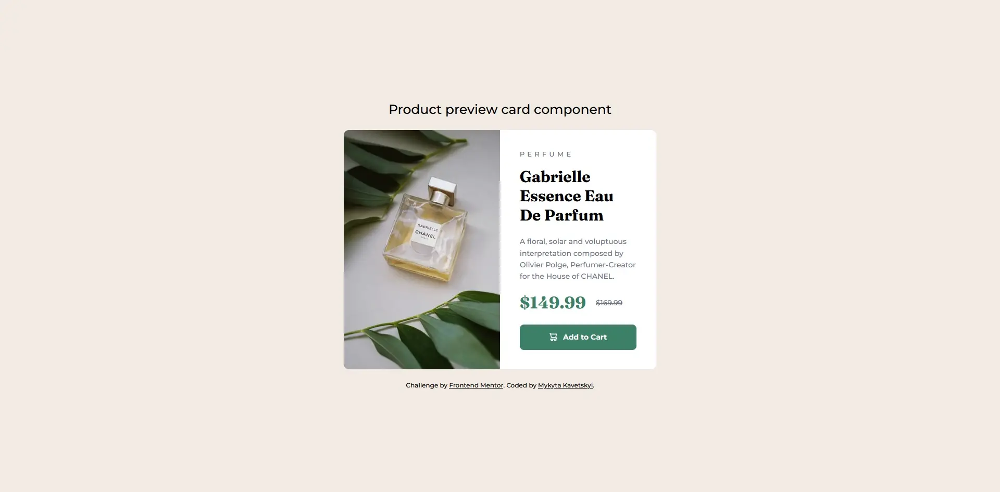
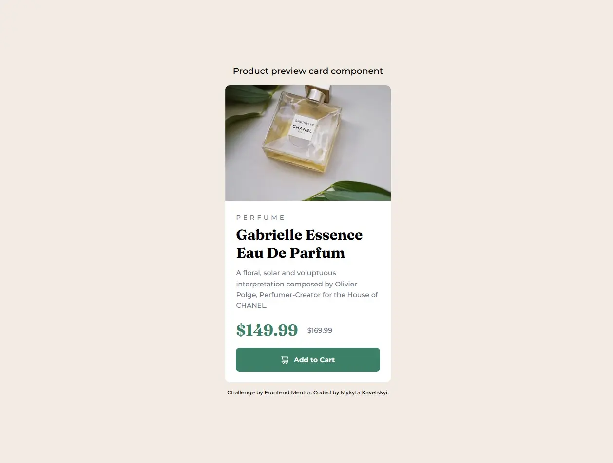

# Frontend Mentor - Product preview card component solution

This is a solution to the [Product preview card component challenge on Frontend Mentor](https://www.frontendmentor.io/challenges/product-preview-card-component-GO7UmttRfa). Frontend Mentor challenges help you improve your coding skills by building realistic projects.

## Table of contents

- [Overview](#overview)
  - [The challenge](#the-challenge)
  - [Screenshots](#screenshots)
  - [Links](#links)
- [My process](#my-process)
  - [Built with](#built-with)
  - [What I learned](#what-i-learned)
  - [Useful resources](#useful-resources)
- [Author](#author)

## Overview

### The challenge

Users should be able to:

- View the optimal layout depending on their device's screen size
- See hover and focus states for interactive elements

### Screenshots

### Links

- Solution URL: [click-on-me](https://github.com/OniOdd/product-preview-card-component)
- Live Site URL: [click-on-me](https://oniodd.github.io/product-preview-card-component/)

## My process

### Built with

- Semantic HTML5 markup
- CSS custom properties
- Flexbox
- BEM
- Mobile-first workflow
- JavaScript

### What I learned

Thanks to this project, I learned how to use responsive images and how to use logical CSS properties (block-size and so on).

### Useful resources

- [MDN Web Docs](https://developer.mozilla.org/) - A useful informative resource.
- [W3Schools](https://www.w3schools.com/) - Another useful informative resource. It also has a useful tool called Color Picker.
- [Code Guide](https://developer.mozilla.org/) - Standards for developing consistent, flexible, and sustainable HTML and CSS.
- [CSS Generator](https://cssgenerator.org/box-shadow-css-generator.html) - A useful tool for customizing box-shadow.

## Author

- LinkedIn - [Mykyta Kavetskyi](https://www.linkedin.com/in/mykyta-kavetskyi/)
- Facebook - [Mykyta Kavetskyi](https://www.facebook.com/profile.php?id=100094490807763)
- Twitter - [@OniOdd](https://twitter.com/OniOdd)
- Frontend Mentor - [@OniOdd](https://www.frontendmentor.io/profile/OniOdd)
